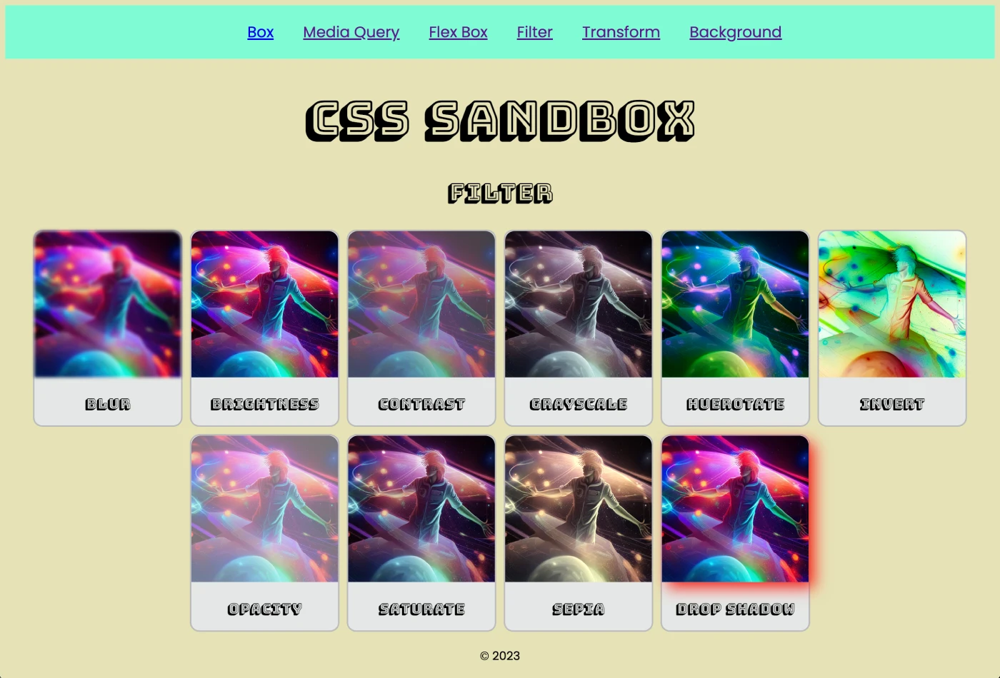

# CSS Sandbox

CSS Sandbox is an interactive notebook developed during C-11, providing students with hands-on experience to practice box model, media queries, flexbox, filters, transforms, and background styling. It serves as a valuable resource for students to refine their skills and gain proficiency.

 

## Website
* 👉 [jsohndata.github.io/css-sandbox](https://jsohndata.github.io/css-sandbox/)

  